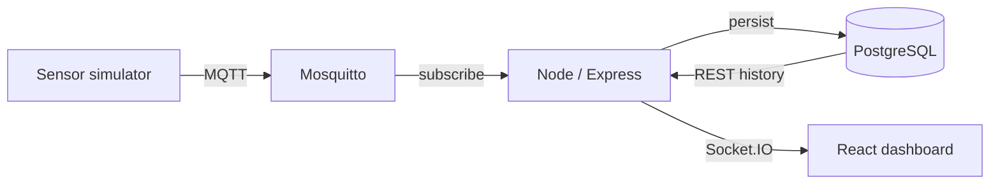

# HavenPulse — IoT Sensor Dashboard

A real-time home intelligence dashboard built with React, Node.js, MQTT, Socket.IO, and PostgreSQL. It imports the supplied 78,000+ historical records, simulates live sensors through Mosquitto, and updates the browser without polling.

## Run it

Prerequisite: Docker Desktop (or Docker Engine with Compose v2).

```bash
docker compose up --build
```

Open **http://localhost:3000**. The first startup imports the JSON files and can take 15–45 seconds. Later starts reuse the database volume. Reset with `docker compose down -v`.

## Architecture



### Why Socket.IO?

MQTT remains the device protocol, while Socket.IO is the browser delivery layer. It provides automatic reconnection, heartbeats, event semantics, and a clean path to rooms for authorization. Direct browser MQTT would expose broker access and couple the UI to device transport. Server-Sent Events would be a good simpler alternative for strictly one-way updates; native WebSockets fit when minimizing overhead matters more than reconnection ergonomics.

### Technical choices

- **PostgreSQL:** durable indexed history and SQL analytics. At scale, add TimescaleDB hypertables, retention, and continuous aggregates.
- **REST + Socket.IO:** REST loads bounded history; Socket.IO appends new points. The browser never receives the whole dataset.
- **Local React state:** one screen with a compact state graph does not justify Redux. A server-cache library becomes valuable as the app grows.
- **Recharts:** responsive React-native SVG charts; D3 would offer deeper customization at significantly higher complexity.
- **Zod:** validates query parameters and MQTT payloads at trust boundaries.

## Features

- Live temperature, humidity, and front-door vibration readings
- MQTT simulator publishing every three seconds
- Connection/reconnection state and pause/resume
- Historical range selection and interactive charts
- 15-minute motion signature visualization
- Smart Guard threshold anomaly detection
- 24-hour analytics and CSV export
- Responsive desktop/mobile interface
- Container health checks and dependency ordering

## API

| Method | Endpoint | Purpose |
|---|---|---|
| GET | `/api/health` | Database and MQTT status |
| GET | `/api/sensors` | Latest reading per metric |
| GET | `/api/readings?metric=temperature&hours=24` | Bounded sensor history |
| GET | `/api/activity?hours=24` | Motion activity buckets |
| GET | `/api/insights` | 24-hour analytics |
| GET | `/api/settings` | Alert thresholds |
| PUT | `/api/settings/:metric` | Update a threshold |
| GET | `/api/export.csv?metric=temperature` | Export recent data |

MQTT topic: `home/sensors/{sensorId}/reading`

```json
{"sensorId":"demo","location":"Bathroom","metric":"temperature","value":24.1,"unit":"°C","timestamp":"2026-09-16T18:00:00.000Z"}
```

## Demo flow

1. Run the stack and open the dashboard.
2. Point out system status and values changing every three seconds.
3. Switch among temperature, humidity, and door activity charts.
4. Pause the UI stream, explain that ingestion continues, then resume.
5. Show thresholds, range controls, motion signature, and CSV export.
6. Publish an anomaly:

```bash
docker compose exec mosquitto mosquitto_pub -t home/sensors/demo/reading -m '{"sensorId":"demo","location":"Bathroom","metric":"temperature","value":34,"unit":"°C","timestamp":"2026-09-16T18:00:00.000Z"}'
```

## Production evolution

- Authenticate users/devices; use TLS and per-device MQTT ACLs.
- Scale Socket.IO with Redis and run stateless API replicas.
- Separate ingestion/simulation and use a durable event queue.
- Add migrations, partitioning, backup/retention, and observability.
- Add integration tests with ephemeral services and browser E2E tests.

## AI usage

AI was used for architecture exploration, scaffolding, UI iteration, edge-case review, and documentation. The output was validated through TypeScript builds and Docker runtime checks. Decisions such as separating MQTT from browser delivery, bounded history, database indexing, and deterministic threshold detection were selected for this problem rather than accepted blindly.

## Project structure

```text
backend/       Express, MQTT subscriber, Socket.IO, seed/API
frontend/      React dashboard and visualizations
data/          Supplied historical JSON
mosquitto.conf Broker configuration
docker-compose.yml
```
